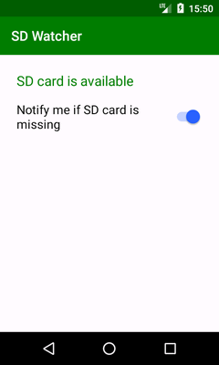
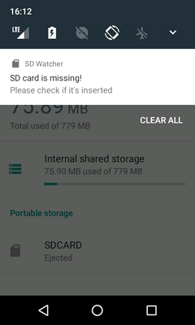

# SD Watcher

Simple Android app to monitor availability of SD card in background and notify if it's missing. Can be useful if SD has a nasty habit of silently disappearing from device.

  

## Installation

This is an Android Studio project.
`minSdkVersion` is set to 21, because several necessary APIs didn't exist before.

## License

Project is distributed under MIT license, feel free to use it.
